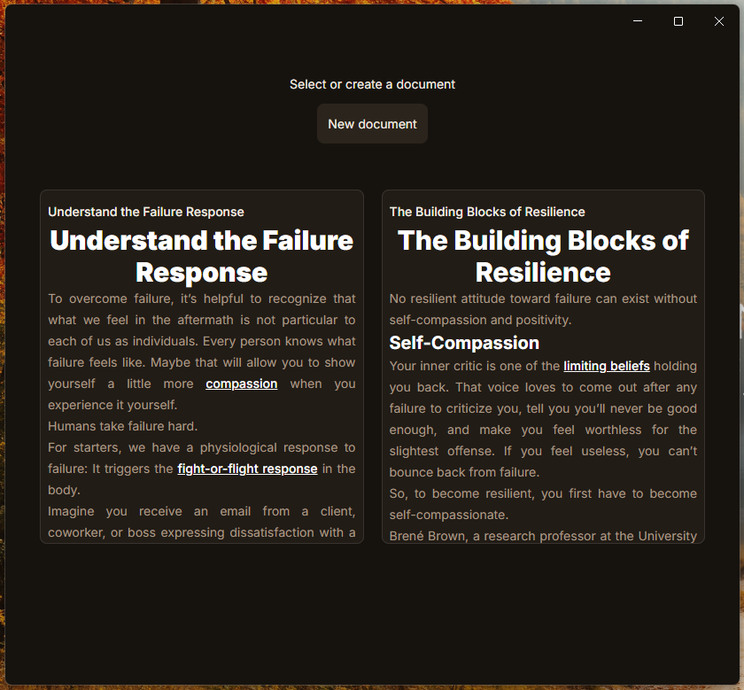
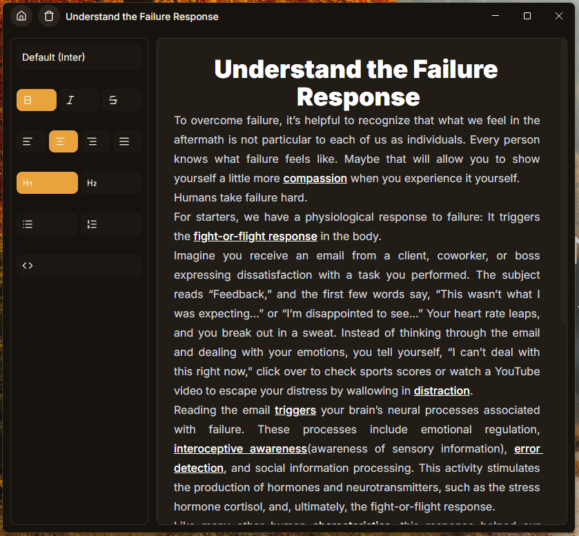

# Inko
Open-Source Desktop App for creating and editing documents with modern technologies and local storage




## Why am I creating this app?
The last year - 2025 - I was in the need of an app in which I could create and edit my notes/documents, but I always found the same problems:
1. You must pay a subscription to use or to store your own documents in the cloud of someone else
2. It is not advanced enough to use it as more than a simple notes app
3. It is old

So I decided to create my own app with everything I like from those apps, something I can use for real, seriously - and if it is useful for someone else, share it.

Inko is the perfect project for me to learn TypeScript, Tailwind and TipTap and get experience from it to start a career as a Software Developer.

## Features
- CRUD on documents
- Document gallery on Home view
- Document preview on the gallery
- Rich text editor with some formats at the moment:
    1. Bold, Italic, Strike
    2. Text alignment (left, right, centre, justify)
    3. Heading (H1, H2)
    4. Ordered and bullet lists
    5. Code block
- Auto-save and disk persistence
- Dark mode UI

## Stack
- React
- TypeScript
- Electron
- Tailwind
- TipTap

## Technical decisions
- Documents are identified with a UUID in the app, allowing user to type the same title for 2 or more documents and preventing references from breaking when a document is renamed
- Colours are managed through a custom theming system built with Tailwind's @theme, using semantic tokens instead of raw colour values
- Structured with Electron's 3-process architecture - main, preload and renderer - keeping direct filesystem access isolated from the renderer for better security

## Roadmap
- Font size in the editor
- Tables and images in the editor
- Export to PDF/Word
- Document preview's performance optimization

## How to run it as developer
```bash
git clone https://github.com/ljdr-dev/Inko.git
cd Inko
npm install
npm run dev
```
